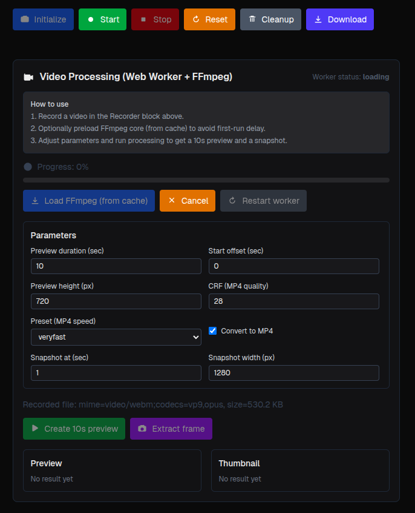

# FFmpeg + Next.js Demo

Демо‑проект для работы с FFmpeg (через ffmpeg.wasm) в среде Next.js. Показывает, как:
- получать медиапоток с камеры и микрофона в браузере,
- кэшировать артефакты FFmpeg для ускорения старта,
- обрабатывать записанные медиафайлы (транскодирование/конвертация) без сервера, прямо в браузере.

---

## Как запустить проект

Требования:
- Node.js 18+ (рекомендуется LTS)
- npm или yarn (любой один пакетный менеджер)

Шаги:
1) Установите зависимости в папке `nextjs`:
   - npm i
   - или: yarn
2) Запустите дев‑сервер:
   - npm run dev
   - или: yarn dev
3) Откройте в браузере http://localhost:3000

Продакшен‑сборка:
- npm run build && npm run start
- или: yarn build && yarn start

Важно:
- Для работы камеры браузер запросит разрешение.
- В некоторых браузерах доступ к камере/микрофону возможен только по HTTPS или на `localhost`.

---

## Основные компоненты

1) Кэш FFmpeg
   - Папка: `components/converter/front/cacheFfmpeg/ffmpegCache.ts`.
   - Отвечает за кэширование бинарей и данных ffmpeg.wasm (например, в памяти/IndexedDB), чтобы при повторных запусках не тратить время на повторную загрузку. Предусмотрены загрузка, чтение и очистка кэша.

2) Работа с камерой
   - Файлы: `components/recorder/media.ts`, `components/recorder/RecorderDashboard.tsx`.
   - Использует MediaDevices.getUserMedia / MediaRecorder для захвата видео/аудио из браузера. Обрабатывает запросы разрешений, старт/стоп записи и передачу полученных медиаблобов дальше в конвейер обработки.

3) Обработка готового медиа
   - Компоненты фронтенд‑воркера: `components/converter/front/worker/FfmpegWorkerPanel.tsx` и связанные модули.
   - Запускает ffmpeg.wasm внутри Web Worker, выполняет транскодирование/конвертацию записанных файлов, извлечение треков/превью и прочие операции — полностью на стороне клиента.

---

## Author

**Oleksandr Nykytin**

- Website: [ninydev.com](https://ninydev.com)
- Email: [keeper@ninydev.com](mailto:keeper@ninydev.com)
